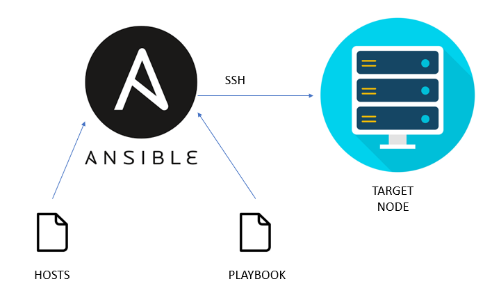
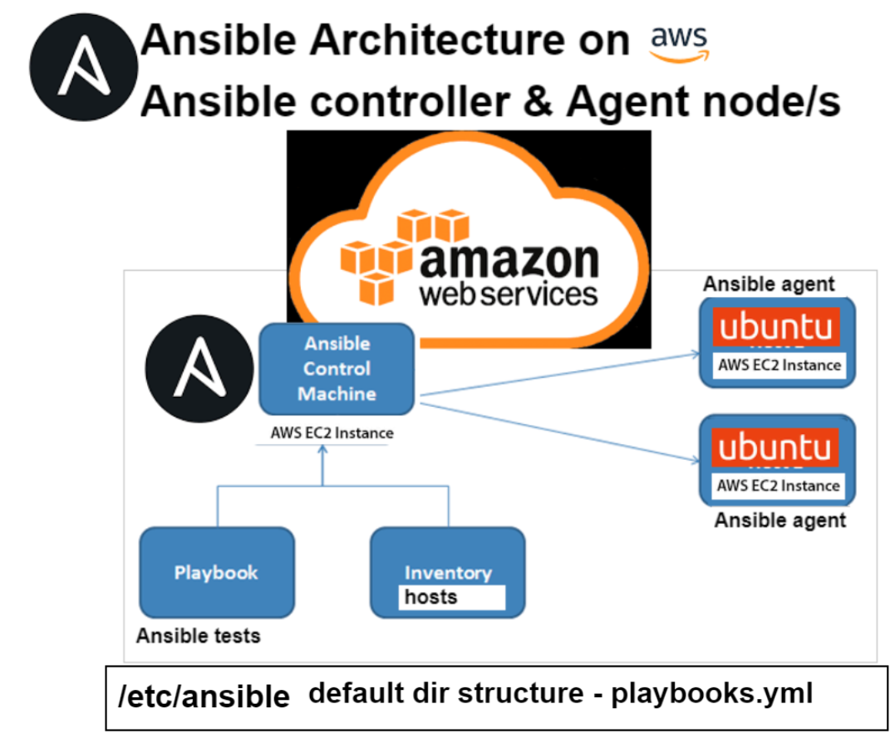
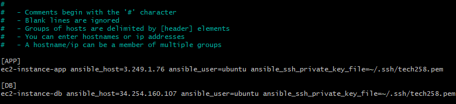
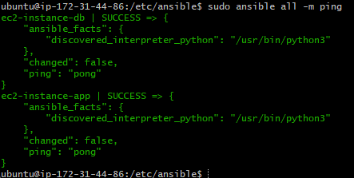
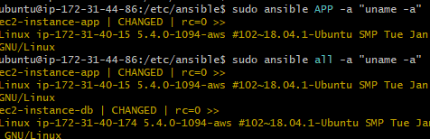
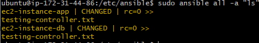

# Ansible

## What is it

Ansible is an open-source, command-line IT automation software written in Python. It simplifies system configuration, software deployment, and workflow orchestration.

There are two parts to it. One is the control node which is where you run all of your commands and coniifugrations.
The ones it manages are called managed nodes. 
The control node contains all the information about how to connect to the managed nodes including ip addresses and SSH keys. This need to be configured manually.
The computer you use to run Ansible commands is the Ansible management node.

## What does it do and how



Ansible simplifies automation by providing a clear, declarative way to manage infrastructure. It's widely used in DevOps, system administration, and cloud environments.

It runs on a control node and that has access to a playbook and hosts file. The hosts file tells it about everything its managing and the playbook is what it needs to do. We can also use adhoc commands to run some tasks on all managed servers quickly nad the playbook is more like a saved list of actions that it needs to run.

**Infrastructure configuration** 
   - Ansible is used for infrastructure automation
   - It helps manage and configure servers, network devices, and cloud resources.
   - Instead of manually configuring each system, Ansible allows you to define the desired state of your infrastructure in a playbook.

**Playbooks and Tasks**:
   - A playbook is a YAML file that describes a set of tasks to be executed on managed nodes.
   - Each task in a playbook represents an action (e.g., installing a package, creating a user, restarting a service).
   - Ansible executes these tasks sequentially.

**Modules**:
   - Ansible uses modules to perform specific actions on managed nodes.
   - Modules are small programs written in Python or other languages.

**Hosts**:
   - The hosts file lists the managed nodes (servers, devices) that Ansible will work with.
   - You define groups of hosts and their connection details (like SSH credentials) in this file.

**Ad-Hoc Commands**:
   - Ansible allows you to run ad-hoc commands directly from the command line.
   - For example, you can use an ad-hoc command to check if a service is running on all servers.

**Agentless Approach**:
   - Ansible is agentless, meaning it doesn't require any software to be installed on managed nodes.
   - It communicates over SSH or other protocols to execute tasks.

**Idempotence**:
   - Ansible ensures that tasks are **idempotent**, meaning they only make necessary changes.
   - If a task has already achieved the desired state, it won't repeat the action.


## Different functions
### Playbook
- a playbook is a file like a script that describes a set of tasks that you want Ansible to perform.
- Playbooks can declare configurations, orchestrate steps of any manual ordered process, on multiple sets of machines, in a defined order, and launch tasks together or separately.

### Adhoc commands
- Adhoc commands are commands which you run from the command line, outside of a playbook.
- These commands run on one or more managed nodes and perform a simple/quick task that you don’t need to repeat. 
- Adhoc commands are one-liner ansible commands that perform one task on the target host. They are not stored for future use, but are a fast way to interact with the desired servers.
- Ad hoc commands are quick and easy, but they are not reusable.
- ad hoc commands are great for tasks you repeat rarely. For example, if you want to power off all the machines in your lab for Christmas vacation, you could execute a quick one-liner in Ansible


## Benefits

- Open source - Free
- Agentless
- Simple and powerful 
- Uses YAML - user friendly mark up language
- Flexible - lets you orchestrate the entire application environment, regardless of where it’s deployed


## How we use it

- Launching our app and DB servers from other projects




### High level overview

**3 Instances** <br>
1. **1 Control node**
   1. Contains hosts file and playbook file
2. **2 Managed instances**
   1. App instance
   2. Database instance
- Need a controller node to control any instance
- It can connect to the instances and perform any actions without first going on to the instances and installing an agent (agentless)
- It installs the dependencies for you in the background without you having to worry, its abstracted away from you.

### Set up instances

1. Set up 3 ec2 instances with the names app, db and control and configure them to have the right security groups (for now SSH on port 22 is adequate)
2. Connect to the control instance via SSH
3. Run `sudo apt update` and `sudo apt upgrade` command then
4. `sudo apt-add-repository ppa:ansible/ansible`
5. `sudo apt-get install ansible`

#### Ansible installed

### Set up hosts file

1. Now need to copy your ssh key into the server into **_~/.ssh_**
2. Can do this by using scp or even copy and pasting using a text editor `scp -i ~/.ssh/mytest.key user@dest_ip:/<filepath on host> <path on client>` 
3. `scp -i ~/.ssh/tech258.pem ~/.ssh/tech258.pem ubuntu@ip:~/.ssh/`
4. :warning: DO NOT SKIP THIS STEP - Run sudo chmod 400 key_name to make it read only by owner (necessary step otherwise key could become invalidated)
5. Need to tell ansible to use this so go to cd /etc/ansible and sudo nano hosts
6. Insert the name of the host and its ip and the user and the key in this format:
7. ```
   [APP]
   ec2-instance-app ansible_host=3.249.1.76 ansible_user=ubuntu ansible_ssh_private_key_file=~/.ssh/tech258.pem
   ```
8. 

### Simple Adhoc Commands

1. A good check to do is ping your managed instances to see if you can connect to them
   - `sudo ansible all -m ping`
   - Should give you a result like this 
   - <br><br>
**_Add this to your /etc/anisble/ansible.cfg file to avoid having to confirm the fingerprint on first time connection_**
 ```
[ssh_connection]
ssh_args = -o StrictHostKeyChecking=no
```


1. Run commands by using sudo ansible then name of app then -a then "command" eg 
   - `sudo ansible APP -a "uname -a"`
      - `-a` means arguments so we want to pass something into ansible. In this case we are using it to pass the commands in the quotation marks to whicver servers we have selected (in this case all of them)
2. If we want to run it on all we can replace app with all so  `sudo ansible all -a "uname -a"`
3.  <br><br><br>


1. Another example is copying a file over
2. Can create a file called testing-controller.txt on the controller node using `touch testing-controller.txt`
3. Then use the following command to send it where it needs to go, or everywhere using the built-in copy function
   - `ansible all -m copy -a "src=/path/to/source/file dest=/path/to/destination/file"`
      - The -m flag in the ansible command stands for "module." It allows you to specify which Ansible module you want to execute on the target hosts. Modules are essentially standalone scripts that Ansible uses to perform tasks on remote systems
4. We can check it ran by using the all function again with the -a 
5. 

### Playbook 

**Creating a playbook to install nginx**

1. Create a file called nginx-playbook.yml
2. Add the following script
    ```bash
    # Creating a playbook to install/configure nginx in the webserver
    ---
    # YAML starts with three dashes
    
    # add the name of the host app
    - hosts: APP
    
    # see the logs, gather facts
      gather_facts: yes
    
    # provide admin access - sudo (adds sudo to every command)
      become: true
    
    # add instructions to install nginx on the app server
      tasks:
      - name: Installing Nginx web server
        apt: pkg=nginx state=present
    ```
3. Run the playbook by using `sudo ansible-playbook nginx-playbook.yml`
4. Check nginx is running `sudo ansible APP -a "sudo systemctl status nginx"`
