[//]: # (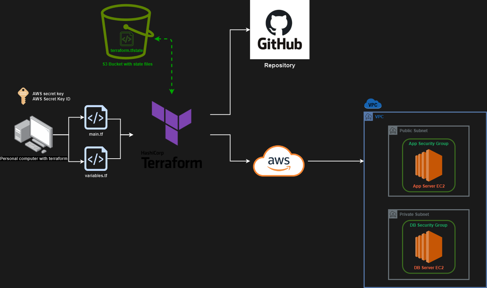)


<div style="width:750px; margin: auto;">

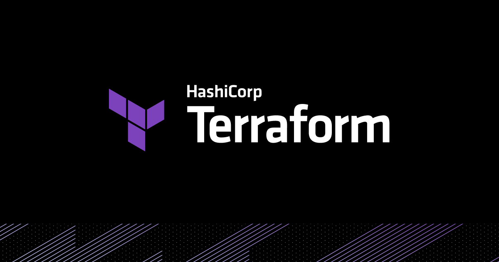
</div>


<div style="width:750px; margin: auto;">

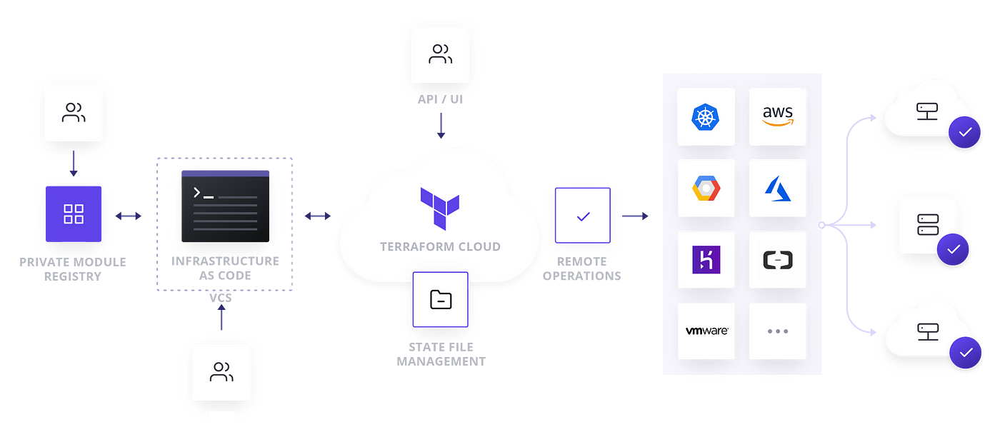
</div>

# Terraform 

<!-- TOC -->
* [Terraform](#terraform-)
  * [What is it](#what-is-it)
    * [Desired state vs current state](#desired-state-vs-current-state)
      * [Desired State](#desired-state)
      * [Current state](#current-state)
      * [How terraform uses both](#how-terraform-uses-both)
  * [Benefits](#benefits)
  * [Using terraform](#using-terraform)
    * [The plan](#the-plan-)
    * [Installation](#installation)
  * [Creating first job](#creating-first-job)
      * [Initialise](#initialise)
    * [Plan](#plan)
    * [Running first job](#running-first-job-)
    * [Creating separate variable file](#creating-separate-variable-file)
    * [Full job](#full-job)
    * [Git ignore](#git-ignore)
  * [Creating a script to launch a service on multiple providers - GitHub and AWS](#creating-a-script-to-launch-a-service-on-multiple-providers---github-and-aws)
  * [Other useful information](#other-useful-information)
  * [Appendix](#appendix)
    * [Installation guide](#installation-guide-)
    * [Transferring security group rules to variables.tf](#transferring-security-group-rules-to-variablestf)
      * [Original main: <br><br>](#original-main-brbr)
      * [New variables file](#new-variables-file)
      * [New main file](#new-main-file)
<!-- TOC -->


## What is it

**This is an orchestration tool that can provision resources in the cloud using declarative code**

- It uses .tf files which JSON format.
- The syntax of these is not very strict
- It is a tool that helps provision cloud resources with commands in a simplified manner by using your credentials and API tools from cloud providers 

### Desired state vs current state

#### Desired State

- This is what you want the state of your resources to look like. 
- You specify this with configuration files or **_.tf_** files
- This tells terraform the resources you want, their configurations and where you want them

#### Current state

- This is the state your resources are currently in
- This could be their configurations or if they even exist at all 
- Terraform keeps track of these in a file once you have initialised it. it will go and save what the state of your resources look like in a file called **_terraform.tfstate_**

#### How terraform uses both

- Terraform checks your desired state in your .tf file
- It then goes to check your resources where you have asked to deploy them and reads their current state  
- If there is any difference, terraform will pick it up and giive you a plan on what it needs to do to make the relevant changes
- Once you have checked the plan you can tell terraform to go and make those changes
- The current state file then gets updated after it makes the changes


## Benefits

- Automate infrastructure provision
- Allows to keep configurations how you set them up
- Version control for your cloud infrastructure 
- Reduces human error in set up once code is set up
- Easily repeatable scripts
- Cloud Agnostic - can be used for multiple providers - AWS, Azure, GitHub etc

## Using terraform

### The plan 

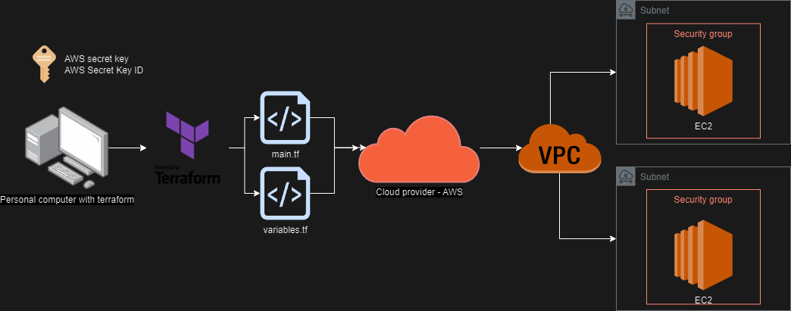

- Going to use my pc with terraform installed to create resources within AWS.
- I will set up my AWS keys so they are used on my system to authenticate and authorise me to make changes to my environment.
- Going to create two files:
  - main.tf (main script)
  - variables.tf (variables that the main script refers to)
- Using these scripts I am going to use terraform to run these scripts and launch resources within my AWS environment
  - **a VPC**
  - **2 subnets**
    - public for app
    - private for db
  - **2 Security groups**
    - one for app
    - one for db
  - **2 instances** 
    - app
    - db

**Use the following commands**

- **`terraform init`**: Initializes a working directory containing Terraform configuration files. This command downloads necessary plugins and sets up the backend.

- **`terraform plan`**: Creates an execution plan, showing what actions Terraform will take to achieve the desired state defined in the configuration files. It helps to verify the changes before applying them.

- **`terraform apply`**: Applies the changes required to reach the desired state of the configuration. It provisions or modifies the infrastructure accordingly.

- **`terraform destroy`**: Destroys the infrastructure managed by the configuration files. It is used to clean up and remove all resources defined in the configurations.

### Installation

:warning: **_DO NOT COMMIT ANY CODE UNTIL YOU HAVE SET UP THE .gitignore file_** :warning: <br>
:warning: **_DO NOT INCLUDE SECRET KEYS OR ID IN ANY CODE_** :warning:

- [_Click here_](https://developer.hashicorp.com/terraform/tutorials/aws-get-started/install-cli#install-cli) for full official installation <br><br>
- Full installation guide found in appendix

## Creating first job

#### Initialise

:warning: **_DO NOT COMMIT ANY CODE UNTIL YOU HAVE SET UP THE .gitignore file_** :warning: <br>
:warning: **_DO NOT INCLUDE SECRET KEYS OR ID IN ANY CODE_** :warning:

1. **Go to your directory where you would like to use terraform** <br><br>
2. **Create a file with the ending of .tf** <br><br>
3. **In this file add lines to specify your provider and region** 
    ```hcl
   provider "aws"{
    
            region = "eu-west-1"
    }
    ```
    <br>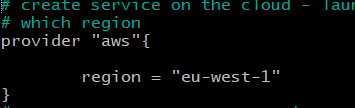 <br><br>
   - This tells terraform what provider and consequently which dependencies to run when we use terraform init <br><br>
   
4. **Save it and run `terraform init` to initialise terraform into your working directory.** <br>
   - Output should look like this: <br> 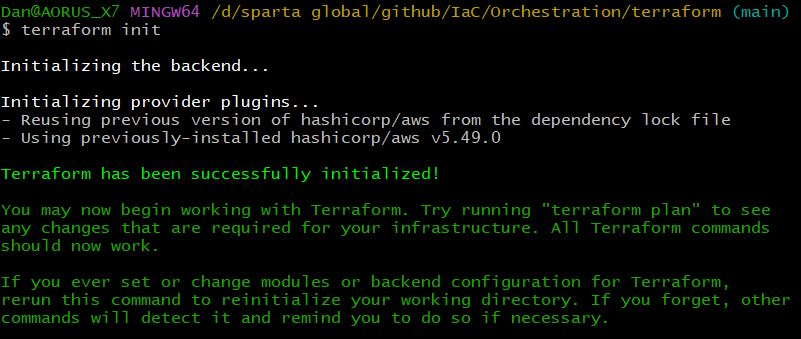 <br><br>

### Plan
**Now go back to your main.tf file and create first terraform job**  <br><br>
   - Plan what you need  
   - Here is my example 
```hcl
# create service on the cloud - launch an ec2 instance on aws
# which region
provider "aws"{

        region = "eu-west-1"
}
# MUST NOT HARD CODE ANY KEYS!
# MUST NOT PUSH ANYTHING TO GITHUB UNTIL WE HAVE CREATED A .gitignore file
# which service/resources - ec2
# which type of instance - AMI to use            
# size - t2 micro            
# associate public ip with instance          
# name resource  
```
   - We can then populate our plan with some declarative code which will tell terraform what to do (not how to do it)

```hcl
   # create service on the cloud - launch an ec2 instance on aws
    # which region
    provider "aws"{
    
            region = "eu-west-1"
    }
    # MUST NOT HARD CODE ANY KEYS!
    # MUST NOT PUSH ANYTHING TO GITHUB UNTIL WE HAVE CREATED A .gitignore file
    # which service/resources - ec2
    resource "aws_instance" "app_instance" {
    
    # which type of instance - AMI to use
            ami = "ami-02f0341ac93c96375"
    
    # size - t2 micro
            instance_type = "t2.micro"
    
    # associate public ip with instance
            associate_public_ip_address = true
    
    # name resource
            tags = {
                    Name = "dan-terraform-tech258-app"
            }
    }
     
```

### Running first job   

1. **Now we have our code, we can use** `terraform plan`
    - This creates an execution plan, which lets you preview the changes that Terraform plans to make to your infrastructure. When Terraform creates a plan it reads the current state of any already-existing remote objects to make sure that the Terraform state is up-to-date
    - This will give us a big output of things it understood from our code and what its going to create
    - Once we reviewed it and are happy we can move on <br><br> <div style="width:500px; margin: left;"> 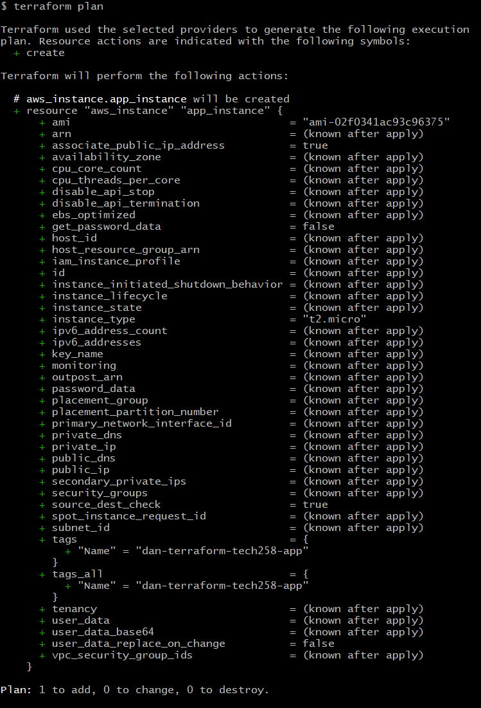 </div> <br><br> <br>
2. **Once the plan has been made we can use `terraform apply` to tell terraform to go and make all those changes** <br><br>
    - It will show you your plan and ask you to confirm if you want to go ahead and you must type yes to continue <br><br>  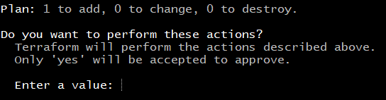 <br><br>
    - It will then go and make your resources <br> 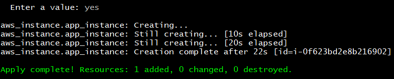 <br><br>
    - We can verify this on the AWS console <br> 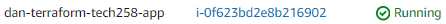 <br><br> <br><br> <br>
3. **We can use `terraform destroy` to terminate resources** (such as the ones we made in our main.tf) <br><br>
    - It will give us the same confirmation with the plan in which we have to put yes to continue <br> 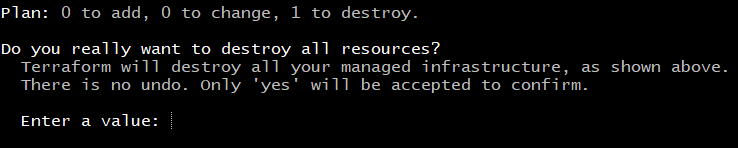 <br> 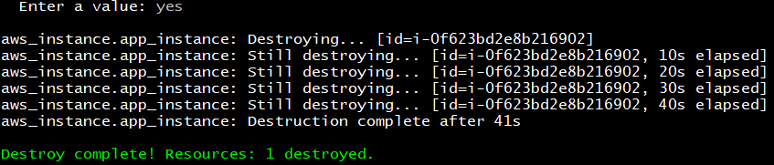 <br><br>
    - Can confirm in the console again <br> 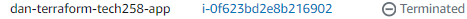 <br><br><br><br>


### Creating separate variable file

- We should create a separate file called _variables.tf_. 
- This can include any sensitive data that we dont want in our main script
- It is alo useful as it helps to adhere to DRY principle - dont repeat yourself
- DRY makes the code more efficient and readable
- In my variable file I will put the image ID and cidr blocks then refer back to them 
- I will also at the end refer to my security group and its rules which I will show at the bottom of the doc

1. Create a file called `variables.tf`
2. In here add what you want to reference. For example the AMI.
    ```hcl
    # create variables to use in main.tf 
    # ami
    variable "app_ami_id" {
         default = "ami-02f0341ac93c96375"
    }
   ```
   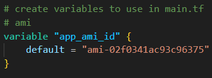
3. Refer back to this in main so go to wherever ami is used using _var.(variablename)_ <br>
4. `ami = var.app_ami_id` <br>
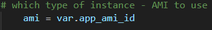
### Full job

- The full job now has a main.tf and a variables.tf that it can reference
- We can hide sensitive data in our variables file and do not include it in our repo (see Git ignore section)
- The full job will create our VPC, public & private subnets, app and db security groups and 2 VMs. One for the app and one for the DB.
- The full main.tf and variables.tf file are in the appendix

### Git ignore
- We need to ignore 5 files in our `.gitignore` file
- We dont want people finding our sensitive data such as keys or IP addresses in a public repo
- The 5 files we need to ignore are
  1. .terraform/
  2. .terraform.lock.hcl
  3. terraform.tfstate
  4. terraform.tfstate.backup
  5. variable.tf
- Create a .gitignore file on your directory
- ```bash
  # .gitignore file

    # Ignore Terraform state files
    *.tfstate
    *.tfstate.backup
    
    # Ignore variable files
    variables.tf
    
    # Ignore .terraform directory
    .terraform/
    
    # Ignore any other sensitive files
    *.tfvars
    terraform.tfvars
  ```
- Verify they are not included by opening gitbash and running `git status --ignored`
- 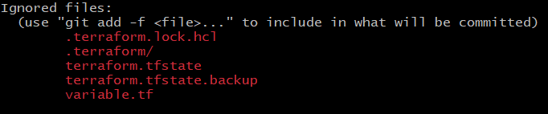

## Creating a script to launch a service on multiple providers - GitHub and AWS


- To create resources on two different providers we have to specify them in our file and ensure we have the right access
- Can store the statefile in an s3 bucket so multiple people can access it
- First we need a token for Github
Creating a GitHub repository with an access token using Terraform involves a few steps. First, you need to set up a GitHub personal access token with the necessary permissions. Then, you will use the Terraform GitHub provider to create and manage the repository. Here is a step-by-step guide:

1. **Generate a GitHub Personal Access Token**:
   - Go to your GitHub account settings.
   - Navigate to "Developer settings" -> "Personal access tokens".
   - Click "Generate new token".
   - Give the token a descriptive name and select the scopes you need (e.g., `repo` for full control of private repositories).
   - Generate the token and save it securely. You will need it for Terraform configuration.

**Easy unsecure method:**

1. add the following content to main.tf :

   ```hcl
   provider "github" {
     token = var.github_token
   }

   resource "github_repository" "example" {
     name        = "example-repo"
     description = "This is an example repository created using Terraform"
     private     = false
   }
   ```
2. add the following to variables.tf
    ```hcl
    variable "github_token" {
    default = "your_github_personal_access_token"
    }
    
   ```
3. Run `terraform init -upgrade` to tell terraform to install the github modules it needs
4. Run `terraform apply`

**Better more secure method:**

1. **Set Up Your Terraform Configuration**:
   add the following content to main.tf :

   ```hcl
   provider "github" {
     token = var.github_token
   }

   resource "github_repository" "example" {
     name        = "example-repo"
     description = "This is an example repository created using Terraform"
     private     = false
   }

   variable "github_token" {
     type      = string
     sensitive = true
   }
   ```

2. **Edit `variables.tf` File**:
   add the following to `variables.tf` file to define the `github_token` variable:

   ```hcl
   variable "github_token" {
     description = "GitHub personal access token"
     type        = string
   }
   ```

3. **Create a `terraform.tfvars` File**:
   Create a `terraform.tfvars` file in the same directory to provide the value for your GitHub token:

   ```hcl
   github_token = "your_github_personal_access_token"
   ```

   Replace `"your_github_personal_access_token"` with the actual token you generated earlier.

4. **Initialize Terraform**:
   Open a terminal, navigate to your project directory, and run the following command to initialize Terraform:

   ```sh
   terraform init
   ```

5. **Apply the Configuration**:
   Run the following command to create the GitHub repository:

   ```sh
   terraform apply
   ```

   Terraform will prompt you to confirm that you want to create the resources. Type `yes` and press Enter.

If everything is configured correctly, Terraform will create the repository on GitHub using the provided access token.

### Example Directory Structure:
```
/terraform-github-repo
  ├── main.tf
  ├── variables.tf
  └── terraform.tfvars
```

### Security Note:
Make sure to keep your `terraform.tfvars` file secure and avoid committing it to version control. Alternatively, you can provide the GitHub token via environment variables to keep it more secure. To do this, you can modify the `provider` block in `main.tf` to look like this:

```hcl
provider "github" {
  token = var.github_token
}

variable "github_token" {
  type        = string
  description = "GitHub personal access token"
  sensitive   = true
}
```

And then set the environment variable before running `terraform apply`:

```sh
export TF_VAR_github_token="your_github_personal_access_token"
terraform apply
```

This method keeps your token out of your configuration files and more secure.

Putting sensitive information like a GitHub token directly into your `variables.tf` file is generally not recommended for several reasons:

1. **Security Risks**:
   - **Exposure**: Storing sensitive data directly in the configuration files increases the risk of accidentally exposing these credentials, especially if the files are checked into version control systems like GitHub.
   - **Shared Access**: If multiple people have access to your Terraform configuration files, they all would have access to the sensitive data.

2. **Best Practices**:
   - **Separation of Configuration and Secrets**: It's a best practice to keep configuration separate from secrets. This approach ensures that sensitive information is handled more securely and can be rotated or managed without modifying the configuration files.
   - **Environment-Specific Configuration**: Using environment variables or dedicated secret management tools allows different environments (development, staging, production) to use different credentials without changing the code.

### Using `terraform.tfvars` for Secrets

One common approach is to use a `terraform.tfvars` file to store secrets, which you can ensure is excluded from version control:

1. **Update `.gitignore`**:
   Add `terraform.tfvars` to your `.gitignore` file to ensure it is not tracked by version control:

   ```plaintext
   terraform.tfvars
   ```

2. **Create `terraform.tfvars`**:
   Create a `terraform.tfvars` file and add your GitHub token:

   ```hcl
   github_token = "your_github_personal_access_token"
   ```

3. **Use `variables.tf` to Define Variables**:
   Define the variable in `variables.tf` without setting the value directly:

   ```hcl
   variable "github_token" {
     description = "GitHub personal access token"
     type        = string
     sensitive   = true
   }
   ```

4. **Configure Provider in `github_aws.tf`**:
   Use the variable in your Terraform configuration:

   ```hcl
   provider "github" {
     token = var.github_token
   }

   resource "github_repository" "example" {
     name        = "example-repo"
     description = "This is an example repository created using Terraform"
     private     = false
   }
   ```

### Alternative: Using Environment Variables

Another secure method is to use environment variables:

1. **Set Environment Variable**:
   Set the GitHub token as an environment variable:

   ```sh
   export TF_VAR_github_token="your_github_personal_access_token"
   ```

2. **Define Variable in `variables.tf`**:
   Define the variable without a default value:

   ```hcl
   variable "github_token" {
     description = "GitHub personal access token"
     type        = string
     sensitive   = true
   }
   ```

3. **Configure Provider in `github_aws.tf`**:
   Use the variable in your Terraform configuration:

   ```hcl
   provider "github" {
     token = var.github_token
   }

   resource "github_repository" "example" {
     name        = "example-repo"
     description = "This is an example repository created using Terraform"
     private     = false
   }
   ```

### Summary

By keeping sensitive information out of your `variables.tf` file and using either a `terraform.tfvars` file (excluded from version control) or environment variables, you enhance the security of your Terraform configurations. This approach aligns with best practices for managing sensitive data and ensures that your infrastructure remains secure.

## Other useful information

- If we type `terraform` it will give us some useful commands <br>
  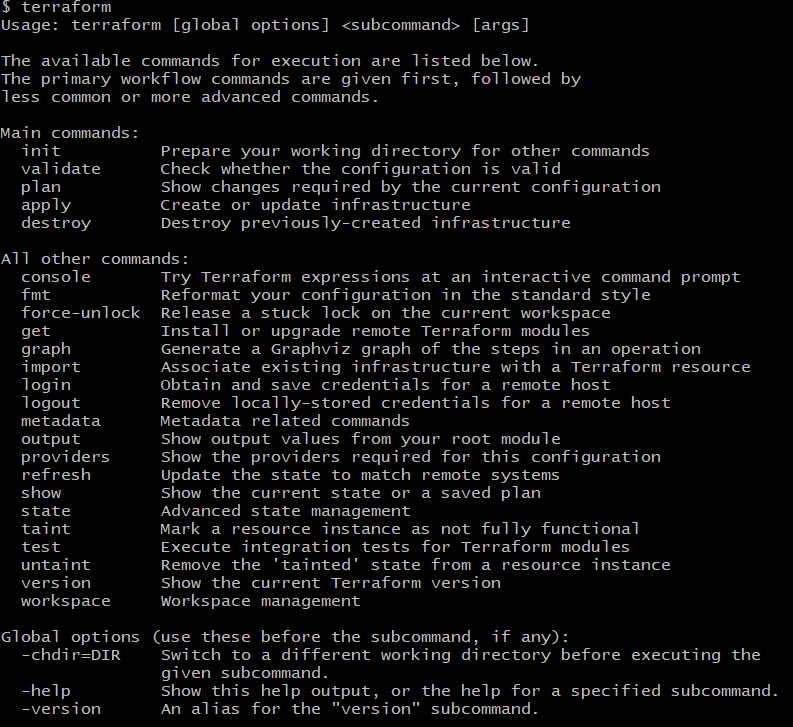 <br><br>
- A useful one to stop instances rather than terminate is `terraform apply -var 'instance_id=<your_instance_id>' -var 'desired_state=stopped`

## Appendix

### Installation guide 

:warning: **_DO NOT COMMIT ANY CODE UNTIL YOU HAVE SET UP THE .gitignore file_** :warning: <br>
:warning: **_DO NOT INCLUDE SECRET KEYS OR ID IN ANY CODE_** :warning:

- [_Click here_](https://developer.hashicorp.com/terraform/tutorials/aws-get-started/install-cli#install-cli) for full official installation <br><br>
  - Need to download file and then register its path <br><br>
    1. **Open _run_ in windows and type in** `sysdm.cpl` <br>  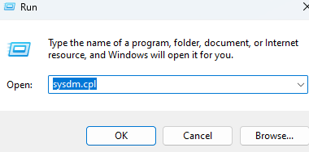 <br><br>
    2. **Go to advanced and then environment variables** <br> 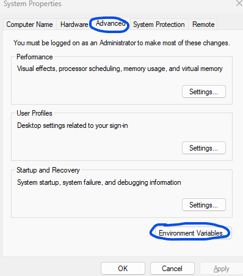 <br><br>
    3. **Go to path and click edit** <br> 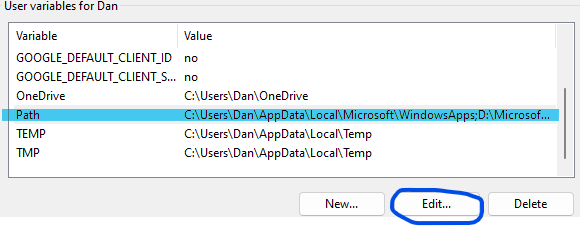 <br><br>
    4. **Add your path to where you have the downloaded terraform file and click ok** <br> 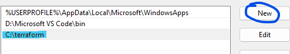 <br><br>
    5. **Check it has worked by checking version in git bash use command** `terraform -v`<br> 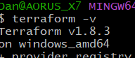 <br><br>
    6. **In the same place where you set the environment variables you can add your AWS secret key and ID so that terraform can use it when it wants to create resources for you without you needing to specify them.**
       - It checks this by looking for 2 specific variables that must be saved as: 
       - `AWS_ACCESS_KEY_ID`
       - `AWS_SECRET_ACCESS_KEY`
       - Can also use this:
          ```bash
          export AWS_ACCESS_KEY_ID="your-access-key-id"
          export AWS_SECRET_ACCESS_KEY="your-secret-access-key"
          export AWS_DEFAULT_REGION="your-preferred-region"
          ```
### Transferring security group rules to variables.tf

#### Original main: <br><br>

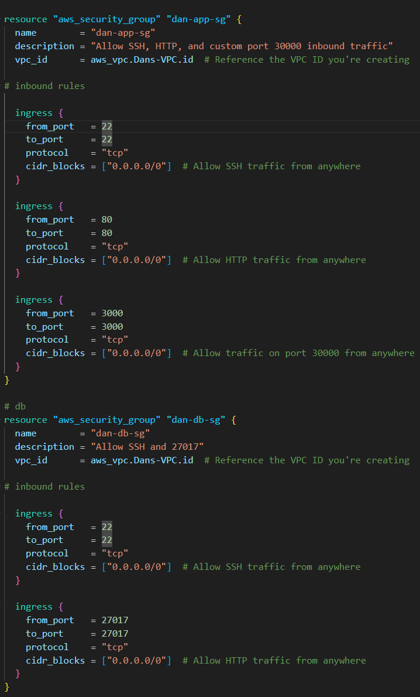
<p align="center"> screenshot showing the security group rules being declared in the main.tf </p>
<br><br>

```hcl
# create security groups
#app

resource "aws_security_group" "dan-app-sg" {
  name        = "dan-app-sg"
  description = "Allow SSH, HTTP, and custom port 30000 inbound traffic"
  vpc_id      = aws_vpc.Dans-VPC.id  # Reference the VPC ID you're creating

# inbound rules

  ingress {
    from_port   = 22
    to_port     = 22
    protocol    = "tcp"
    cidr_blocks = ["0.0.0.0/0"]  # Allow SSH traffic from anywhere
  }

  ingress {
    from_port   = 80
    to_port     = 80
    protocol    = "tcp"
    cidr_blocks = ["0.0.0.0/0"]  # Allow HTTP traffic from anywhere
  }

  ingress {
    from_port   = 3000
    to_port     = 3000
    protocol    = "tcp"
    cidr_blocks = ["0.0.0.0/0"]  # Allow traffic on port 30000 from anywhere
  }
}

# db
resource "aws_security_group" "dan-db-sg" {
  name        = "dan-db-sg"
  description = "Allow SSH and 27017"
  vpc_id      = aws_vpc.Dans-VPC.id  # Reference the VPC ID you're creating

# inbound rules

  ingress {
    from_port   = 22
    to_port     = 22
    protocol    = "tcp"
    cidr_blocks = ["0.0.0.0/0"]  # Allow SSH traffic from anywhere
  }

  ingress {
    from_port   = 27017
    to_port     = 27017
    protocol    = "tcp"
    cidr_blocks = ["0.0.0.0/0"]  # Allow HTTP traffic from anywhere
  }
```
#### New variables file

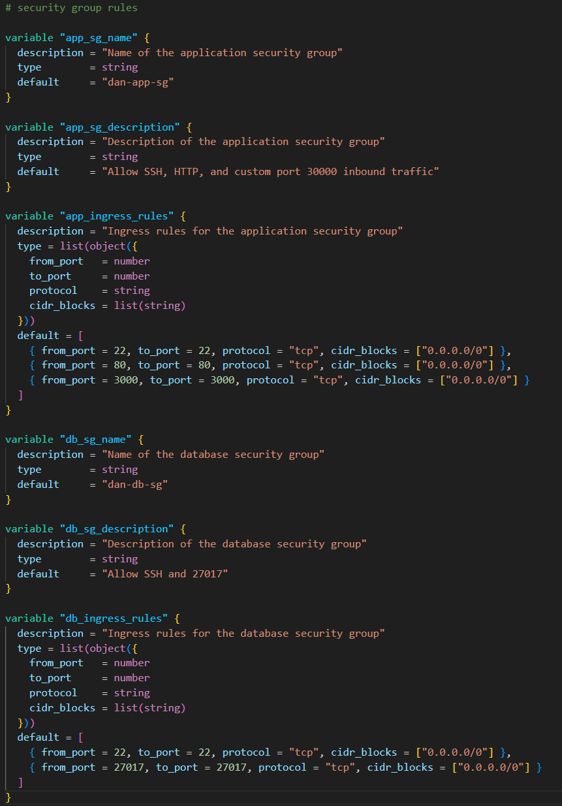
<p align="center"> screenshot showing the new Security group variable </p>
<br><br>

```hcl
# create variables to use in main.tf 
# ami
variable "app_ami_id" {
    default = "ami-02f0341ac93c96375"
}

# vpc cidr
variable "vpc_cidr_block" {
    default = "10.0.0.0/16"
  
}

# public subnet cidr
variable "public_subnet_cidr_block" {
    default = "10.0.3.0/24"
  
}

# private subnet cidr
variable "private_subnet_cidr_block" {
    default = "10.0.4.0/24"
  
}

# security group rules

variable "app_sg_name" {
  description = "Name of the application security group"
  type        = string
  default     = "dan-app-sg"
}

variable "app_sg_description" {
  description = "Description of the application security group"
  type        = string
  default     = "Allow SSH, HTTP, and custom port 30000 inbound traffic"
}

variable "app_ingress_rules" {
  description = "Ingress rules for the application security group"
  type = list(object({
    from_port   = number
    to_port     = number
    protocol    = string
    cidr_blocks = list(string)
  }))
  default = [
    { from_port = 22, to_port = 22, protocol = "tcp", cidr_blocks = ["0.0.0.0/0"] },
    { from_port = 80, to_port = 80, protocol = "tcp", cidr_blocks = ["0.0.0.0/0"] },
    { from_port = 3000, to_port = 3000, protocol = "tcp", cidr_blocks = ["0.0.0.0/0"] }
  ]
}

variable "db_sg_name" {
  description = "Name of the database security group"
  type        = string
  default     = "dan-db-sg"
}

variable "db_sg_description" {
  description = "Description of the database security group"
  type        = string
  default     = "Allow SSH and 27017"
}

variable "db_ingress_rules" {
  description = "Ingress rules for the database security group"
  type = list(object({
    from_port   = number
    to_port     = number
    protocol    = string
    cidr_blocks = list(string)
  }))
  default = [
    { from_port = 22, to_port = 22, protocol = "tcp", cidr_blocks = ["0.0.0.0/0"] },
    { from_port = 27017, to_port = 27017, protocol = "tcp", cidr_blocks = ["0.0.0.0/0"] }
  ]
}

```


#### New main file

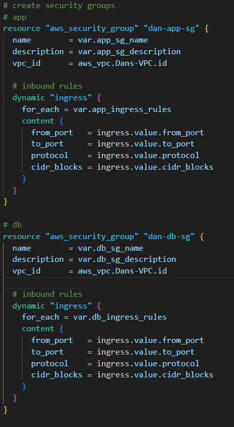
<p align="center"> screenshot showing the new Security group variable being referred to</p>
<br><br>

```terraform
# create service on the cloud - launch an ec2 instance on aws
# which region
provider "aws"{

	region = "eu-west-1"
}
# MUST NOT HARD CODE ANY KEYS!
# MUST NOT PUSH ANYTHING TO GITHUB UNTIL WE HAVE CREATED A .gitignore file


# create vpc

resource "aws_vpc" "Dans-VPC" {

    cidr_block = var.vpc_cidr_block
}

# create subnet public (refers back to vpc being made)

resource "aws_subnet" "public_subnet" {
    vpc_id = aws_vpc.Dans-VPC.id
    cidr_block = var.public_subnet_cidr_block
}

# create subnet private (refers back to vpc being made)

resource "aws_subnet" "private_subnet" {
    vpc_id = aws_vpc.Dans-VPC.id
    cidr_block = var.private_subnet_cidr_block
}

# create security groups
# app
resource "aws_security_group" "dan-app-sg" {
  name        = var.app_sg_name
  description = var.app_sg_description
  vpc_id      = aws_vpc.Dans-VPC.id  

  # inbound rules
  dynamic "ingress" {
    for_each = var.app_ingress_rules
    content {
      from_port   = ingress.value.from_port
      to_port     = ingress.value.to_port
      protocol    = ingress.value.protocol
      cidr_blocks = ingress.value.cidr_blocks
    }
  }
}

# db
resource "aws_security_group" "dan-db-sg" {
  name        = var.db_sg_name
  description = var.db_sg_description
  vpc_id      = aws_vpc.Dans-VPC.id  

  # inbound rules
  dynamic "ingress" {
    for_each = var.db_ingress_rules
    content {
      from_port   = ingress.value.from_port
      to_port     = ingress.value.to_port
      protocol    = ingress.value.protocol
      cidr_blocks = ingress.value.cidr_blocks
    }
  }
}


# create app instance

resource "aws_instance" "dan-app"{

# subnet (refers back to public subnet being made)
    subnet_id = aws_subnet.public_subnet.id
# which type of instance - AMI to use
	# ami = "ami-02f0341ac93c96375"
	ami = var.app_ami_id

# size - t2 micro
	instance_type = "t2.micro"

# associate public ip with instance
	associate_public_ip_address = true

# security group
    security_groups = [aws_security_group.dan-app-sg.id]

# key pair
    key_name = "tech258"
# name resource
	tags = {
		Name = "dan-terraform-tech258-app"
	}
}

# create db instance

resource "aws_instance" "dan-db"{

# subnet (refers back to private subnet being made)
    subnet_id = aws_subnet.private_subnet.id
# which type of instance - AMI to use
	ami = var.app_ami_id

# size - t2 micro
	instance_type = "t2.micro"

# associate public ip with instance
	associate_public_ip_address = true

# security group using id
    security_groups = [aws_security_group.dan-db-sg.id]

# key pair
    key_name = "tech258"
# name resource
	tags = {
		Name = "dan-terraform-tech258-db"
	}
}
```


