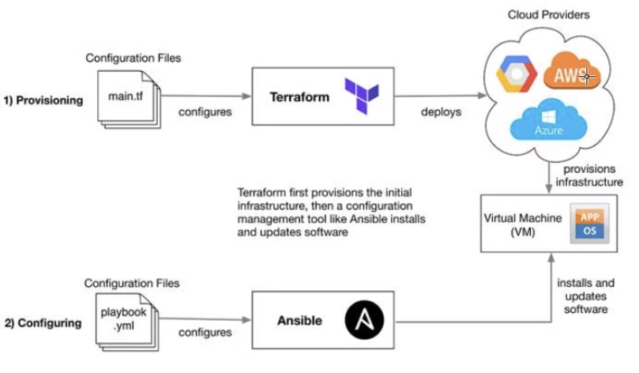

# IaC - Infrastructure as Code

Can automate tasks for us
Speeds up manual tasks 
reduces human error
quick provisioning
less worry about architecture once done, dont have to repay yourself, DRY

## Orchestration - Terraform

Creates and provisions resources in the cloud

## Configuration Management - Ansible

Configures resources in the cloud and maintains configurations automatically 